# NeRF [ECCV'20]の理解と再実装
本レポジトリは東京大学大学院講義「映像メディア学」の最終レポートです．

## はじめに
本レポートでは，コンピュータビジョンのトップ会議であるECCV2020の本会議に採択された論文である，"NeRF: Representing Scenes as Neural Radiance Fields for View Synthesis" [Mildenhall+, [ECCV'20](https://www.ecva.net/papers/eccv_2020/papers_ECCV/papers/123460392.pdf)] （[プロジェクトページ](https://www.matthewtancik.com/nerf)）について取り上げる．まず，この論文の概要およびこの論文が重要である理由について述べ，続いて自分が行った再現実装について述べる．

## 論文概要
NeRF [Mildenhall+, [ECCV'20](https://www.ecva.net/papers/eccv_2020/papers_ECCV/papers/123460392.pdf)]は，ある物体を撮影した複数の画像があるときに，その物体を別の視点から見た際の画像を生成する新規視点画像生成のタスクにおいて，従来の結果を大きく凌駕する結果を示した手法である．NeRFでは，3Dデータの表現として，従来のメッシュや点群のような明示的な表現ではなく，3次元座標$`\boldsymbol{x}`$に対応する3D情報をニューラルネットワーク$`f(\boldsymbol{x})`$で隠的に表現するNeural Fieldの手法を採用しており，近年の3D Computer Vision分野におけるNeural Fieldブームの火付け役といえる．

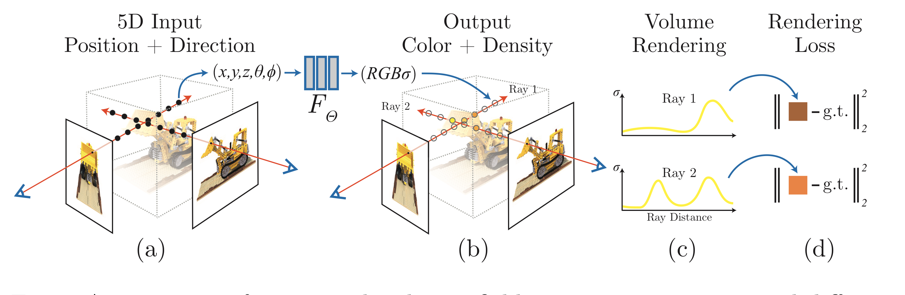

ここでは，NeRFの具体的な構造について，上の図をもとに見る．なお，図は論文 (NeRF [Mildenhall+, [ECCV'20](https://www.ecva.net/papers/eccv_2020/papers_ECCV/papers/123460392.pdf)])のFig. 2を引用した．

NeRFのアーキテクチャにおける最大の特徴は，与えられた訓練画像群から，3次元座標$`\boldsymbol{x}`$と視線方向$`\boldsymbol{d}`$を入力として，対応する色$`\boldsymbol{c}`$と密度$`\sigma`$を出力するニューラルネットワークを学習することである．すなわち，画像を訓練データとして，一種の回帰モデルを学習していることになる．そして，ある視点から見た画像を出力する際には，視点位置から各方向に向かって光線を飛ばし，光線上の各点の色と密度の情報を用いて古典的なボリュームレンダリングの計算を行う (ボリュームレンダリングの詳細については"Volume Rendering Digest (for NeRF)" [Tagliasacchi+, [arXiv:2209.02417](https://arxiv.org/abs/2209.02417)]が詳しい).このボリュームレンダリングは本質的に微分可能な演算であるため，出力画像と観測画像との誤差を誤差関数としてニューラルネットワークを学習させていくことで，新規視点画像生成を実現することができる．

## この論文が重要である理由
この論文が重要である理由として，以下の2点を挙げる．1点目は，新規視点画像生成という本質的に3次元的なタスクを，教師となる3Dモデルを必要とせず，画像のみで実現できるアーキテクチャを実現したことである．2点目は，ただ新規視点画像生成を実現するだけにとどまらず，論文中において，さらに高いクオリティの出力結果を得るための工夫を提案していることである．NeRFは，この2点のおかげで，応用の際に使いやすさの面でもクオリティの面でも有用な手法となっているために，大きな注目を集めたのだと思われる．以下では，この2点についてそれぞれ述べる．

### 教師となる3Dモデルが不要であること
通常，3次元画像処理を行う場合，訓練時の教師データとして，メッシュや点群のような形で表現された3Dモデルのデータが必要となる．しかし一般的に，3Dモデルのデータは画像に比べて入手方法が限られているため，そのような方法だと，手法の適用範囲が大幅に制限されてしまう．一方，NeRFはボリュームレンダリングを活用することで，3Dモデルのデータがなくても，対象を撮影した画像のみから3D情報を学習可能なフレームワークを構築できている．これは，3次元画像処理のゲームチェンジャー的な意味を持っており，そのためにこの論文は重要であるといえる．

### 高いクオリティの出力結果を得るための工夫を提案していること
NeRFの論文 [Mildenhall+, [ECCV'20](https://www.ecva.net/papers/eccv_2020/papers_ECCV/papers/123460392.pdf)]によると，上述したボリュームレンダリングによる手法をそのまま実装すると，出力結果はぼやけた画像になってしまい，高解像度な出力結果を得られないという．この問題に関して，NeRFの著者らは，深層学習モデルが低周波関数へのバイアスを持つという仮説 ("
On the Spectral Bias of Neural Networks” [Rahaman+, [ICML'19](https://proceedings.mlr.press/v97/rahaman19a.html)])をもとに，入力値を前もって高周波関数で高次元空間に写像してやることで，より高解像度でクオリティの高い出力画像を得られると考えた．

具体的には，あるスカラーの実数値$`p\in\mathbb{R}`$が入力として与えられた際に，NeRFは以下のようなPositional Encodigと呼ばれる関数$`\gamma(p)`$を用いて，入力値を高次元空間$`\mathbb{R}^{2L}`$に写像する．

$$\gamma(p) = (\sin(2^0\pi p), \cos(2^0\pi p) , \cdots, \sin(2^L\pi p), \cos(2^L\pi p))$$

このPositonal Encodingは，NeRFで生成される新規視点画像のクオリティの向上に大きく寄与していることが確認されている．例えば，下の画像はNeRFの論文 [Mildenhall+, [ECCV'20](https://www.ecva.net/papers/eccv_2020/papers_ECCV/papers/123460392.pdf)] のFIg. 4から引用したものである．左から4番目のPositional Encodingを利用していないモデルの出力結果に比べると，左から2番目のNeRFの出力結果は，対象物体に含まれる細かい要素を，より精細に捉えられていることがわかる．

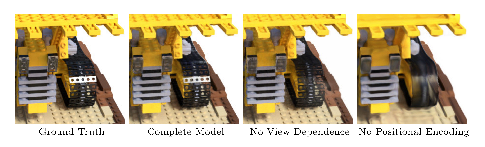

このように，ただ単純に新規視点画像生成のタスクを実現するだけでなく，その出力画像のクオリティに関しても丁寧に考察を行い，問題を解決する手法を新たに提案していることが，この論文の重要性をさらに高めていると思われる．

## 再現実装・自分で実装した部分
これまで見てきたNeRFについて，自分で再現実装を行った．NeRFは，著者による実装が[レポジトリ](https://github.com/bmild/nerf)で公開されており，その中に含まれる[tiny_nerf](https://github.com/bmild/nerf/blob/master/tiny_nerf.ipynb)は，ニューラルネットワークの入力を3次元座標$`\boldsymbol{x}`$のみとし，視線方向$`\boldsymbol{d}`$を除外するなど，シンプルな実装となっている．自分の再現実装は，このtiny_nerfの実装を参考にして，新たに自分で実装を行った．自分の実装がtiny_nerfと異なる点は以下の通りである．
- tiny_nerfは，機械学習の部分がTensorFlowによって実装されている．しかし，近年機械学習フレームワークとしてPyTorchが主流になっているのを受け，今後の自分の研究に向けた練習として，今回はPyTorchによる実装を行った．一部の実装，例えばtf.math.cumprod関数に対応するPyTorchの関数や，ニューラルネットワークの初期値の設定方法などは，NeRFの実装をPyTorchで行った別の実装（[tiny_nerfに準拠したもの](https://colab.research.google.com/drive/1rO8xo0TemN67d4mTpakrKrLp03b9bgCX#scrollTo=Qbdf8GDL4_0Z)，[tiny_nerfに準拠していないもの](https://github.com/ALBERT-Inc/blog_nerf/blob/master/NeRF.ipynb)）も一部参考にしている．一方で，前述したPositonal Encodingを実装した関数や，各データの構造をPyTorchのTensorに対応するようにするために必要な処理，それに伴うDeviceとの送受信処理などは，PyTorchの公式ドキュメントを自分で調べながら実装を行った．
- tiny_nerfのコードや上述したPyTorchによる別の実装のコードを，そのままコピーペーストすることはせず，自分で内容について考え，やっていることを理解しながらコードを記述するようにし，その思考の過程をコード中のコメントとして残すようにした．
- tiny_nerfはipynbノートブックによって実装されていたが，自分の実装は，実際の研究でのコーディングの実態に則して，通常のpythonファイルによって実装した．

## 結果

自分で実装したNeRFのコードを利用して，tiny_nerfのデータセットに含まれるレゴブロックの車を撮影した画像100枚で訓練を行い，新規視点画像での出力結果を得た．今回は，2つの新規視点における出力結果を見る．

### 1つ目の新規視点
まず，1つ目の新規視点における出力結果を見る．1つ目の新規視点におけるGround truthは以下の画像である．
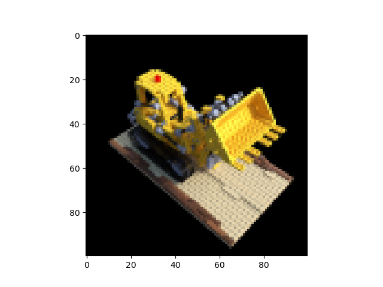

今回実装したNeRFモデルを用いて，この視点の画像を生成すると，学習の各インテレーションにおける出力結果は以下のようになった．

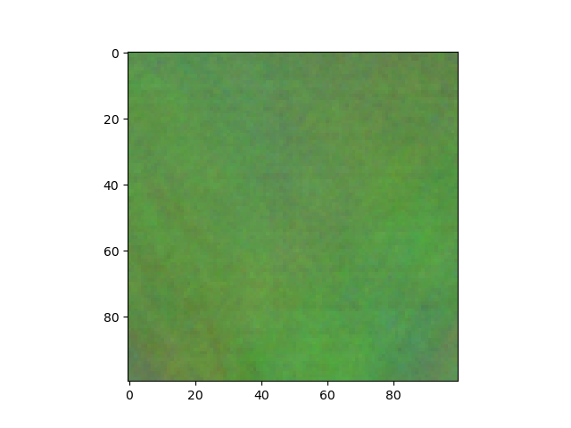

↑0イテレーション目．

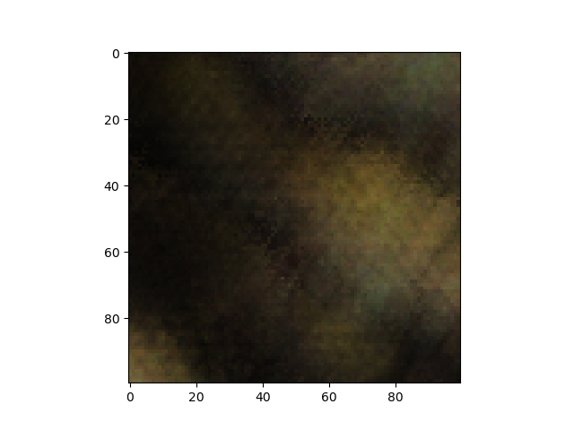

↑400イテレーション目．

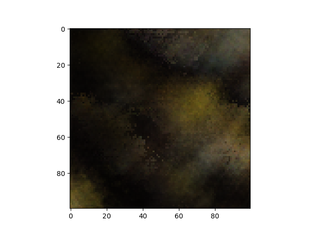

↑800イテレーション目．

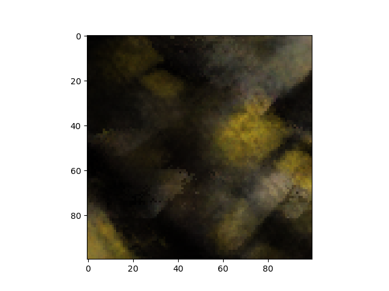

↑3200イテレーション目．

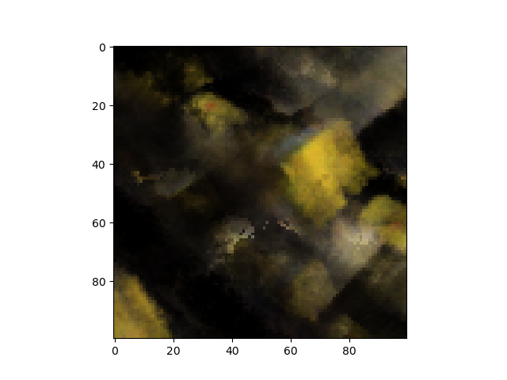

↑9900イテレーション目．

### 2つ目の新規視点
続いて，2つ目の新規視点における出力結果を見る．2つ目の新規視点におけるGround truthは以下の画像である．

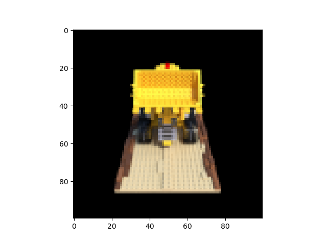

今回実装したNeRFモデルを用いて，この視点の画像を生成すると，学習の各インテレーションにおける出力結果は以下のようになった．

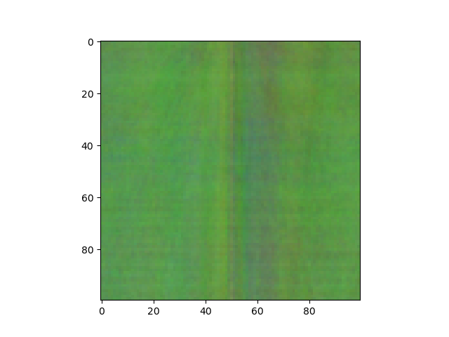

↑0イテレーション目．

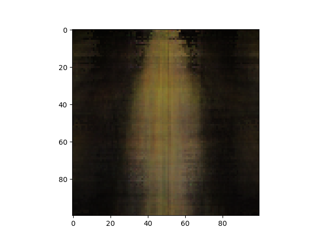

↑400イテレーション目．

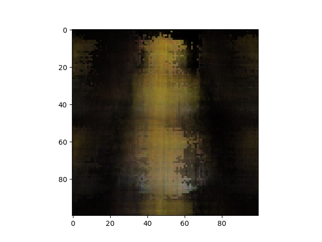

↑800イテレーション目．

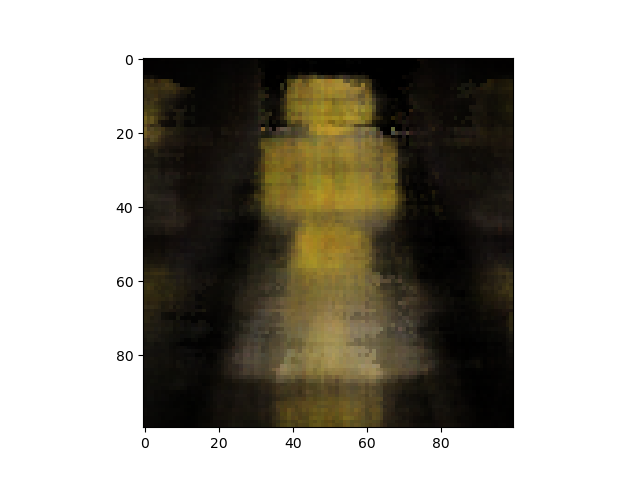

↑3200イテレーション目．

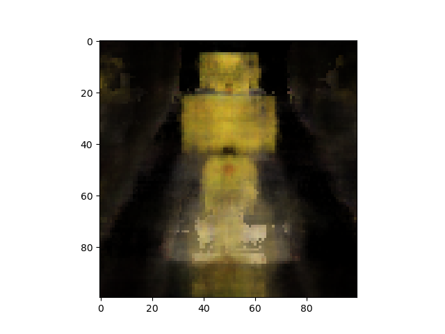

↑9900イテレーション目．

### 結果の考察
2つの結果を見ると，学習前ではノイズのような画像しか出力できなかったのに対し，学習が進むにつれて，よりレゴブロックの車に近い画像へと色や形状が近づいていっていることが確認される．このことから，確かにNeRFのアーキテクチャには，訓練によって新規視点の画像を近似できる能力があるといえる．一方で，今回実装したコードでは，10000イテレーション程度の訓練を行っても，Ground Truthの画像を再現するには至らず，ノイズのような部分がはっきりと残ってしまう結果となった．これは，自分のコーディングにおいて，3D座標の計算などで意図せぬ誤りが含まれてしまったために，正しく学習が行えていない可能性がある．そのため，今後自分が実装したコードを見返して，バグがないか確認していきたいと思う．

## 感想
今回のレポートを通して，ただ論文を読むだけでなく，実際にコードを読んだり書いたりすることの重要性を改めて実感した．実際，私はNeRFの論文自体は前々から読んだことがあり，内容についてある程度理解していると思っていたが，実際にコードを書いてみると，細かい実装に関してまだまだ知らないことががたくさんあったのだと感じた．今後の研究生活においても，機会があれば積極的に論文の再現実装に取り組んでいきたい．
